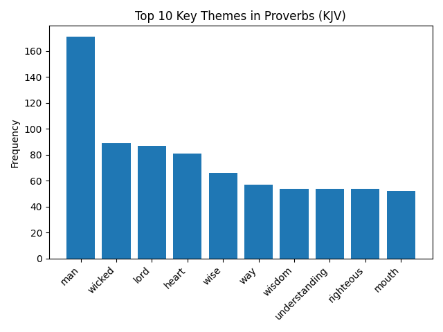

# Python Bible Text Analysis & Visualization (KJV JSON API Example)

This repository demonstrates how to retrieve **KJV Bible text programmatically in Python** using the BibleBridge JSON Bible API and perform **word-frequency analysis and visualization** locally.

If you are looking for a **Python Bible API example** or want to perform **Scripture text analysis using structured JSON data**, this repository provides a minimal, production-safe reference implementation.

The included Python script retrieves the Book of Proverbs (KJV), performs word-frequency analysis with stop-word filtering, and generates a visualization of prominent thematic terms.



---

## Overview

This example demonstrates how to:

- Fetch canonical Scripture text from a JSON Bible API
- Perform word-frequency analysis in Python
- Apply stop-word filtering (including KJV-era forms)
- Generate data visualizations from Scripture text

All analysis and visualization occur client-side.  
The API is used strictly as a canonical Scripture data source.

---

## Use Cases

This example may be useful for:

- Academic Bible text analysis
- Sermon research tools
- Thematic word studies
- Scripture-based data visualization projects
- Natural language processing (NLP) experiments on biblical text

---

## Requirements

- Python 3.9 or later
- A BibleBridge API key
- Set your API key as an environment variable before running the script.
- Dependencies listed in `requirements.txt`

---

## Setup

### Add API key as environment variable

Before running the script, set your API key:

```bash
export BIBLEBRIDGE_API_KEY=your_key_here
```

Powershell:
```powershell
setx BIBLEBRIDGE_API_KEY "your_key_here"
```
After running setx, open a new terminal session before running the script.

### Install dependencies

```bash
pip install -r requirements.txt
```
### Run the analysis
```bash
python scriptural_data_visualization.py
```
